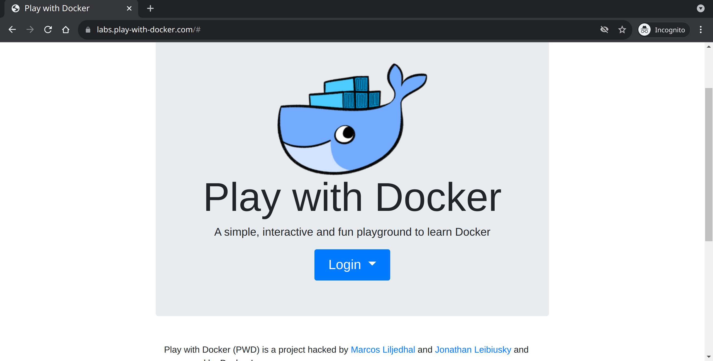
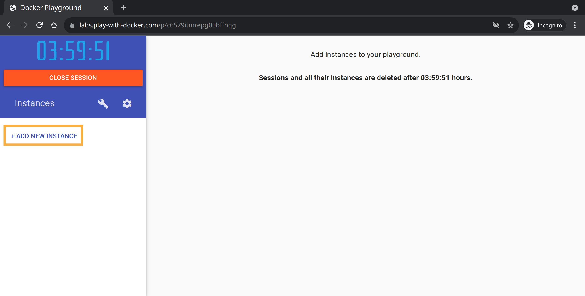

# docker-intro


This intro, we'll dive into using containers using a free tool: https://labs.play-with-docker.com/

Prepare for this lesson by pulling this repository and creating a basic directory structure:

```sh
cd docker-intro*
mkdir -v API
cp -v .API/api.py .API/requirements.txt API/
cd API
```

### System Requirements

This exercise has been constructed using the following software versions. These are not hard requirements.

| Software | Version | Description |
|----------|---------|-------------|
| [BASH](https://www.gnu.org/software/bash/) | `5.0.17(1)-release` | Bash is the GNU Project's shell |
| [Python](https://www.python.org/) | `3.8.10` | Python is an interpreted high-level general-purpose programming language |
| [pip](https://pypi.org/project/pip/) | `20.0.2` | Long time favorite package manager for Python |
| [curl](https://curl.se/) | `7.68.0` | command line tool and library for transferring data with URLs |
| [git](https://git-scm.com/) | `2.25.1` | Git is a free and open source distributed version control system designed to handle everything from small to very large projects with speed and efficiency.


## Get to know the example API application (optional)

Behold `API`: A look at a simple web application written in `Python`.
To launch it locally, move into the API folder and run the application:

```sh
pip install --ignore-installed -r requirements.txt
```

_output:_

```log
Collecting click==8.0.3
  Downloading click-8.0.3-py3-none-any.whl (97 kB)
       |████████████████████████████████| 97 kB 1.7 MB/s
       Collecting Flask==2.0.2
         Downloading Flask-2.0.2-py3-none-any.whl (95 kB)
       |████████████████████████████████| 95 kB 2.0 MB/s
       Collecting Flask-Cors==3.0.10
         Downloading Flask_Cors-3.0.10-py2.py3-none-any.whl (14 kB)
  Collecting itsdangerous==2.0.1
    Downloading itsdangerous-2.0.1-py3-none-any.whl (18 kB)
  Collecting Jinja2==3.0.2
    Downloading Jinja2-3.0.2-py3-none-any.whl (133 kB)
       |████████████████████████████████| 133 kB 22.0 MB/s
       Collecting jsonify==0.5
         Downloading jsonify-0.5.tar.gz (1.0 kB)
  Collecting MarkupSafe==2.0.1
    Downloading MarkupSafe-2.0.1-cp38-cp38-manylinux2010_x86_64.whl (30 kB)
  Collecting six==1.16.0
    Downloading six-1.16.0-py2.py3-none-any.whl (11 kB)
  Collecting Werkzeug==2.0.2
    Downloading Werkzeug-2.0.2-py3-none-any.whl (288 kB)
       |████████████████████████████████| 288 kB 37.4 MB/s
       Building wheels for collected packages: jsonify
         Building wheel for jsonify (setup.py) ... done
           Created wheel for jsonify: filename=jsonify-0.5-py3-none-any.whl size=1562 sha256=c56b2f62f44704cc8fd22e77385605ed0d60ecd8958782c3ec0f7dc3287e27c9
             Stored in directory: /home/dabbler/.cache/pip/wheels/ee/c6/ef/643adfbd90fefe0640cb6ba3b20995a2f50ccc2c57f55b190f
             Successfully built jsonify
             Installing collected packages: click, MarkupSafe, Jinja2, itsdangerous, Werkzeug, Flask, six, Flask-Cors, jsonify
               WARNING: The script flask is installed in '/home/dabbler/.local/bin' which is not on PATH.
                 Consider adding this directory to PATH or, if you prefer to suppress this warning, use --no-warn-script-location.
                 Successfully installed Flask-2.0.2 Flask-Cors-3.0.10 Jinja2-3.0.2 MarkupSafe-2.0.1 Werkzeug-2.0.2 click-8.0.3 itsdangerous-2.0.1 jsonify-0.5 six-1.16.0
```

Run the application:

```sh
./api.py
```

_output:_

```log
 * Serving Flask app 'api' (lazy loading)
 * Environment: production
   WARNING: This is a development server. Do not use it in a production deployment.
   Use a production WSGI server instead.
 * Debug mode: off
 * Running on http://127.0.0.1:5000/ (Press CTRL+C to quit)
```

You can test the responses like so:

```sh
curl -siL -X GET http://localhost:5000/companies
```

_output:_

```log
HTTP/1.0 200 OK
Content-Type: application/json
Content-Length: 119
Access-Control-Allow-Origin: *
Server: Werkzeug/2.0.2 Python/3.8.10

[
  {
    "id": "1",
    "name": "Vincy Productions"
  },
  {
    "id": "2",
    "name": "Kelly Incorporated"
  }
]
```

If we'd like to add another company to this list, we could:

```sh
curl -siL -X POST -H "Content-Type: application/json" http://localhost:5000/companies --data '{"id":"3","name":"BuunDemolitions"}'
```

_output:_

```log
HTTP/1.0 200 OK
Content-Type: application/json
Content-Length: 175
Access-Control-Allow-Origin: *
Server: Werkzeug/2.0.2 Python/3.8.10

[
  {
    "id": "1",
    "name": "Vincy Productions"
  },
  {
    "id": "2",
    "name": "Kelly Incorporated"
  },
  {
    "id": "3",
    "name": "BuunDemolitions"
  }
]
```

To be complete, deleting an item is done like so:

```sh
curl -siL -X DELETE -H "Content-Type: application/json" http://localhost:5000/companies --data '{"id":"2"}'
```

_output:_

```log
HTTP/1.0 200 OK
Content-Type: application/json
Content-Length: 116
Access-Control-Allow-Origin: *
Server: Werkzeug/2.0.2 Python/3.8.10

[
  {
    "id": "1",
    "name": "Vincy Productions"
  },
  {
    "id": "3",
    "name": "BuunDemolitions"
  }
]
```

I think we are ready to deploy this `API` somewhere. We _could_ apply our
knowledge of the application, and configuration management to run it on a
virtual machine.
Let's see if we can leverage the power of container technologies instead.

## Containerize

If you are using [play-with-docker](https://labs.play-with-docker.com/) it's
simple to get started with docker.



Navigate to https://lab.play-with-docker.com/ and login using a docker account.
(You can register here: https://hub.docker.com/signup/)

Once started, you can create a new instance (Play-with-docker web interface:
`ADD NEW INSTANCE`). This will provide you with a terminal to work from your
browser.

> Play-with-docker terminal tips: Copy terminal text using `ctrl`+`insert` and
  paste using `shift`+`insert`



Now that we've been logged in, let's see if we can run a container.
Containers begin their lives based on an image. Let's run a container we know
from Docker Hub's image repository: Let's run a container based on the
`hello-world` image:

```sh
docker run --name hello-world hello-world
```

_output:_

```log
Hello from Docker!
This message shows that your installation appears to be working correctly.

To generate this message, Docker took the following steps:
 1. The Docker client contacted the Docker daemon.
 2. The Docker daemon pulled the "hello-world" image from the Docker Hub.
    (amd64)
 3. The Docker daemon created a new container from that image which runs the
    executable that produces the output you are currently reading.
 4. The Docker daemon streamed that output to the Docker client, which sent it
    to your terminal.

To try something more ambitious, you can run an Ubuntu container with:
 $ docker run -it ubuntu bash

Share images, automate workflows, and more with a free Docker ID:
 https://hub.docker.com/

For more examples and ideas, visit:
 https://docs.docker.com/get-started/
```

While that sure is impressive, we want our own application to run here. We'll
have to create our own docker image.

https://hub.docker.com/ Provides us with many public images to pick from to
base our custom image on. There's an official [Python image](https://hub.docker.com/_/python).

The description of this image provides us with a great example:

```dockerfile
FROM python:3

WORKDIR /usr/src/app

COPY requirements.txt ./
RUN pip install --no-cache-dir -r requirements.txt

COPY . .

CMD [ "python", "./your-daemon-or-script.py" ]
```

Our file will start off very similar. We'll use the same image to base our
custom image on. We can point to this image using the `FROM` keyword in the
`Dockerfile`:

```sh
cat <<EOF | tee Dockerfile
FROM python:3

EOF
```

We'll also be using the same working directory. This gets defined in using the
`WORKDIR` keyword:

```sh
cat <<EOF | tee -a Dockerfile
WORKDIR /usr/src/app

EOF
```

We can't run our application without the application and it's dependencies. The
`COPY` keyword allows us to copy files and directories from the docker context
into the image layer.

```sh
cat <<EOF | tee -a Dockerfile
COPY api.py requirements.txt ./
EOF
```

> In this example we'll copy both `api.py` and `requirements.txt` in once step. Note that in an optimized image this would be frowned upon, as the requirements' cache would be invalidated along with any changes to the application's contents.

Now that our image holds the files we need to install our requirements, let's do
just that, using the `Python` package manager `pip`. We can run shell commands
in our image using the `RUN` keyword:

```sh
cat <<EOF | tee -a Dockerfile
RUN pip install --no-cache-dir -r requirements.txt
EOF
```

> That settles installing the dependencies. Note that `pip` warns of us installing these dependencies as the `root` user. In production environments, we'd use the `USER` keyword to change into the correct user.

Lastly, we'll instruct docker to execute the API by default. `CMD` keyword
allows us to set a default set of parameters to pass after the image's
`ENTRYPOINT`.
As in this case the entry point hasn't been set, only our default command will
be run. (`/usr/src/app/api.py`)

```sh
cat <<EOF | tee -a Dockerfile
CMD ["/usr/src/app/api.py"]
EOF
```

Now that we've described what we want for our docker image in it's manifest,
we can create an image using the `docker build` sub command.

```sh
docker build . --tag company-api:0.1.0
```

_output:_

```log
Sending build context to Docker daemon     47MB
Step 1/5 : FROM python:3
 ---> 4246fb19839f
Step 2/5 : WORKDIR /usr/src/app
 ---> Using cache
 ---> 0786a75a46f9
Step 3/5 : COPY api.py requirements.txt ./
 ---> 8b40b6a92766
Step 4/5 : RUN pip install --no-cache-dir -r requirements.txt
 ---> Running in 75468c8b775d
Collecting click==8.0.3
  Downloading click-8.0.3-py3-none-any.whl (97 kB)
Collecting Flask==2.0.2
  Downloading Flask-2.0.2-py3-none-any.whl (95 kB)
Collecting itsdangerous==2.0.1
  Downloading itsdangerous-2.0.1-py3-none-any.whl (18 kB)
Collecting Jinja2==3.0.2
  Downloading Jinja2-3.0.2-py3-none-any.whl (133 kB)
Collecting MarkupSafe==2.0.1
  Downloading MarkupSafe-2.0.1-cp310-cp310-manylinux_2_5_x86_64.manylinux1_x86_64.manylinux_2_12_x86_64.manylinux2010_x86_64.whl (30 kB)
Collecting Werkzeug==2.0.2
  Downloading Werkzeug-2.0.2-py3-none-any.whl (288 kB)
Installing collected packages: MarkupSafe, Werkzeug, Jinja2, itsdangerous, click, Flask
Successfully installed Flask-2.0.2 Jinja2-3.0.2 MarkupSafe-2.0.1 Werkzeug-2.0.2 click-8.0.3 itsdangerous-2.0.1
WARNING: Running pip as the 'root' user can result in broken permissions and conflicting behaviour with the system package manager. It is recommended to use a virtual environment instead: https://pip.pypa.io/warnings/venv
WARNING: You are using pip version 21.2.4; however, version 21.3.1 is available.
You should consider upgrading via the '/usr/local/bin/python -m pip install --upgrade pip' command.
Removing intermediate container 75468c8b775d
 ---> c74ee228d5c5
Step 5/5 : CMD ["/usr/src/app/api.py"]
 ---> Running in f220e2a548a9
Removing intermediate container f220e2a548a9
 ---> 4d602730840e
Successfully built 4d602730840e
Successfully tagged company-api:0.1.0
```

We have a new container image: `company-api:0.1.0`! List it using:

```sh
docker image ls
```

_output:_

```log
REPOSITORY                                TAG         IMAGE ID       CREATED         SIZE
company-api                               0.1.0       85b9027cec60   just now       928MB
...
```

Let's run it:

```sh
docker run --name company-api -it -p 5000:5000 company-api:0.1.0
```

_output:_

```log
 * Serving Flask app 'api' (lazy loading)
 * Environment: production
   WARNING: This is a development server. Do not use it in a production deployment.
   Use a production WSGI server instead.
 * Debug mode: off
 * Running on all addresses.
   WARNING: This is a development server. Do not use it in a production deployment.
 * Running on http://172.17.0.2:5000/ (Press CTRL+C to quit)
```

You can use the "Open Port" button in the lab's dashboard to open a
working URI to your application. In case of this example it's:
`http://ip172-18-0-54-c658727qf8u00093atb0-5000.direct.labs.play-with-docker.com/`

When prompted for a port number, we can supply port `5000`. (after the port we use in our Python API)

(To actually get a JSON response with companies, don't forget to append `/companies` to your URI: `http://ip172-18-0-54-c658727qf8u00093atb0-5000.direct.labs.play-with-docker.com/companies`)

> When you are ready to move on to the to the next chapter, use `CTRL` + `C` to end the process.

## Orchestrate

Things are getting out of hand pretty quick. In our last exercise we created an API that serves company names. Now the crowd is demanding a nicer web page. JSON isn't really nice to look at for normal humans after all.

### Front end

We'll move out of the `API` folder and create a new folder `Frontend` to manage this application:

```sh
cd ../
mkdir -v Frontend
cp -v .Frontend/index.html Frontend/
cd Frontend
```

Lets create a simple Front end for our API. There's a sub-folder in this project called: `Frontend`. Let's deploy this static `HTML`/`CSS`/`Javascript` project using [`nginx`](https://www.nginx.com/).

Using the search functionality in https://hub.docker.com/ we find that again, there's an official image: `https://hub.docker.com/_/nginx`. Using the search function on docker hub's website is useful, but you don't have to leave the CLI:

```sh
docker search nginx --limit 1
```

_output:_

```log
NAME      DESCRIPTION                STARS     OFFICIAL   AUTOMATED
nginx     Official build of Nginx.   15813     [OK]
```

We'll start from here:

```sh
cat <<EOF | tee Dockerfile
FROM nginx:1.21@sha256:51212c2cc0070084b2061106d5711df55e8aedfc6091c6f96fabeff3e083f355
COPY index.html /usr/share/nginx/html/
EOF
```

> Supplying `FROM nginx:1.21@<digest>` ensures us that the image we reviewed does not change in the future

Build and tag this image, just like we did in our `API` project:

```sh
docker build . --tag company-frontend:0.1.0
```

And run the front end on a free port:

```sh
docker run -d --name company-frontend -p 5001:80 company-frontend:0.1.0
```

If we open the page as-is, the page will load; But there's a strange message:

> Failed to fetch companies

Of course! We never did pass any information regarding where our front end can
find this information. Let's pass this information into the container:

Expand the contents of the Dockerfile like so:

```sh
cat <<EOF | tee -a Dockerfile
COPY custom-entrypoint /

ENTRYPOINT ["/custom-entrypoint"]
CMD ["nginx", "-g", "daemon off;"]
EOF
```

Copy the contents of our example custom entry point like so:

```sh
cp ../.Frontend/custom-entrypoint ./
```

We are adding a `custom-entrypoint` that fills in our target API address and then starts the original NginX startup functionality. the `ENTRYPOINT` keyword defines the default command to run when starting a container from this image. The `CMD` keyword then adds default arguments to that `ENTRYPOINT`.

Each time we update the contents of our `Dockerfile`, we should not forget to update our image:

```sh
docker build . --tag company-frontend:0.1.0
```

Now we have to start these containers individually, making sure not to forget parameters each time... I don't like it. Let's try something new.

### Docker Compose

Let's remove our running containers and try docker-compose files to orchestrate our little setup.

Cleanup the previous containers:

```sh
docker rm --force --volumes hello-world company-api company-frontend
```


Create the `docker-compose.yml` file. The following command will prompt you in the CLI for a URI. As we now know the address our API is available on in play-with-docker, we can fill that in as our `API host address`; In the example in this document, the URI is: `http://ip172-18-0-54-c658727qf8u00093atb0-5000.direct.labs.play-with-docker.com`.

```sh
read -rp 'API host address: '; cat <<EOF | tee docker-compose.yml
version: "3.3"

services:
  frontend:
    image: dabblebe/docker-intro_company-frontend:0.1.0
    ports:
      - "5001:80"
    environment:
      - API_HOST=$REPLY
EOF
```

After that, we can add a similar section in the file, with the specification of our `api`:

```sh
cat <<EOF | tee -a docker-compose.yml

  api:
    image: dabblebe/docker-intro_company-api:0.1.0
    ports:
      - "5000:5000"
EOF
```

Run the `docker-compose` tool:

```sh
docker-compose up
```

_output:_

```log
Starting frontend_api_1        ... done
Recreating frontend_frontend_1 ... done
Attaching to frontend_api_1, frontend_frontend_1
frontend_1  | Setting API_HOST in frontend
api_1       |  * Serving Flask app 'api' (lazy loading)
api_1       |  * Environment: production
api_1       |    WARNING: This is a development server. Do not use it in a production deployment.
api_1       |    Use a production WSGI server instead.
api_1       |  * Debug mode: on
frontend_1  | Replaced API_HOST with http://192.168.0.193:5000
frontend_1  | Custom entrypoint loaded, starting default nginx entrypoint
frontend_1  | /docker-entrypoint.sh: /docker-entrypoint.d/ is not empty, will attempt to perform configuration
frontend_1  | /docker-entrypoint.sh: Looking for shell scripts in /docker-entrypoint.d/
[...]
```

That's a lot less hassle than specifying the docker commands each time.
We want to be able to respond quickly to the increasing demand of our
application, but a single virtual machine has limited capacity. At some point
we'll have to manage multiple nodes, that would be to much manual labor using
docker-compose.

Hit `ctrl` + `C` once to end the docker instances.

That clearly did the trick: Our service is greatly increasing in popularity.

#### Scaling the service

Our clientele is really growing. We've now come to a point where a single front end process can't handle it all anymore. We can keep spawning more processes on this machine if we want. This would be great as long as we still have resources available on our machine. But maintaining this on many machines would be too much hassle.
Ideally, we'd want this orchestration to happen automatically, across multiple nodes. 

### Docker Swarm

We should be able to scale these services quickly, without too much further manual intervention. Let's have a look at dockers built-in orchestrator `swarm`.

To prevent confusion, ensure the last environment has been cleaned up:

```sh
docker-compose down
```

Add new instances to your environment until you have 2 instances. Select
`node1` and execute:

To get the public-facing interface's internal IPv4 address.

```sh
export IP="$( hostname -i )"; echo "$IP"
```

_output:_

```
192.168.0.28
```

Next, we can initialize our node to become a manager node for a new swarm
cluster:

```sh
docker swarm init --advertise-addr "$IP"
```

_output:_

```
Swarm initialized: current node (zquv2c2bta2xzjt58wnct3xwy) is now a manager.

To add a worker to this swarm, run the following command:

    docker swarm join --token SWMTKN-1-0lrr2w6nl9h5vgyhu57t35ws37t3nispfcowjdmouo2qbamyhh-ej1kfevuw0674dpf3atohydll 192.168.0.28:2377

To add a manager to this swarm, run 'docker swarm join-token manager' and follow the instructions.
```

We can copy the suggested command and run this on the second node (`node2`):

```sh
docker swarm join --token SWMTKN-1-0lrr2w6nl9h5vgyhu57t35ws37t3nispfcowjdmouo2qbamyhh-ej1kfevuw0674dpf3atohydll 192.168.0.28:2377
```

_output:_

```
This node joined a swarm as a worker.
```

Back on `node1`, we can query our manager for some information on our new swarm
cluster:

```sh
docker node ls
```

_output:_

```
ID                            HOSTNAME   STATUS    AVAILABILITY   MANAGER STATUS   ENGINE VERSION
zquv2c2bta2xzjt58wnct3xwy *   node1      Ready     Active         Leader           20.10.0
955qsiufqsk4m4b6vtrsmcbpq     node2      Ready     Active                          20.10.0
```

Swarm allows us to describe the workloads we want to run using the
`docker-compose.yml` file, like the one we used earlier.

This time, we'll add 2 replicas for our front end from the get-go. On your manager node, run (`node1`):

```sh
cat <<EOF | patch docker-compose.yml -
9a10,12
>   deploy:
>     mode: replicated
>     replicas: 2
EOF
```


Now we can ask swarm to deploy this stack, referring to our compose file we generated just now.

```sh
docker stack deploy --compose-file ./docker-compose.yml company-platform
```

_output:_

```log
Creating network company-platform_default
Creating service company-platform_frontend
Creating service company-platform_api
```

This will create a new desired state in the swarm cluster. You can follow the progress of the swarm cluster in fulfilling this desired state by running:

```sh
docker service ls
```

_output:_

```log
ID             NAME                        MODE         REPLICAS   IMAGE                                          PORTS
y4i2u2bkalfz   company-platform_api        replicated   1/1        dabblebe/docker-intro_company-api:0.1.0        *:5000->5000/tcp
wkih4eet1pog   company-platform_frontend   replicated   2/2        dabblebe/docker-intro_company-frontend:0.1.0   *:5001->80/tcp
```

It seems that in the above output swarm has been able to create 3 process,
spread over our 2 nodes (`node1` and `node2`). Lets have a look at where these
`tasks` are running:

```sh
docker service ps company-platform_api company-platform_frontend
```

_output:_

```log
ID             NAME                          IMAGE                                          NODE      DESIRED STATE   CURRENT STATE           ERROR     PORTS
3fpxvi3ikj9a   company-platform_api.1        dabblebe/docker-intro_company-api:0.1.0        node1     Running         Running 3 minutes ago
5zn8y0v3xtv7   company-platform_frontend.1   dabblebe/docker-intro_company-frontend:0.1.0   node2     Running         Running 3 minutes ago
tlog64gxre08   company-platform_frontend.2   dabblebe/docker-intro_company-frontend:0.1.0   node1     Running         Running 3 minutes ago
```

The output tells us:
- our `company-platform_api.1` process was assigned to `node1` and is `Running`
- `company-platform_frontend.1` is `Running` on `node2`
- `company-platform_frontend.2` is `Running` on `node`

Lastly, lets see the fruits of our labors; Press the `OPEN PORT` button again (Found in the play-with-docker web interface) and open port 5001 this time.

You'll be greeted with our application once more. This time being served from on of the 2 nodes in our swarm cluster. Congratulations!

# Conclusion

In this tutorial, gone from single-host container management to full-on cluster orchestration.
We covered a lot, but we've only scratched the surface of what's possible.

If you are hungry for more exercises, please check out the `Further dabbling` section.

# Further dabbling

## Optimize `Dockerfiles`
We created some `Dockerfiles` in this exercise. They are not up to par with
optimization standards. Can you find bad practices?

Hint: https://docs.docker.com/develop/develop-images/dockerfile_best-practices/

## More
More coming soon!
